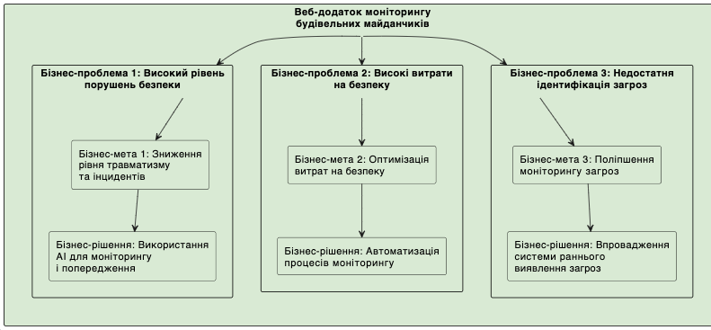

```
@startuml
skinparam rectangle {
  BackgroundColor #D9EAD3
  BorderColor Black
}

rectangle "Веб-додаток моніторингу\nбудівельних майданчиків" as project {
    rectangle "Бізнес-проблема 1: Високий рівень\nпорушень безпеки" as problem1 {
        rectangle "Бізнес-мета 1: Зниження\nрівня травматизму\nта інцидентів" as goal1
        rectangle "Бізнес-рішення: Використання\nAI для моніторингу\nі попередження" as solution1
    }

    rectangle "Бізнес-проблема 2: Високі витрати\nна безпеку" as problem2 {
        rectangle "Бізнес-мета 2: Оптимізація\nвитрат на безпеку" as goal2
        rectangle "Бізнес-рішення: Автоматизація\nпроцесів моніторингу" as solution2
    }

    rectangle "Бізнес-проблема 3: Недостатня\nідентифікація загроз" as problem3 {
        rectangle "Бізнес-мета 3: Поліпшення\nмоніторингу загроз" as goal3
        rectangle "Бізнес-рішення: Впровадження\nсистеми раннього\nвиявлення загроз" as solution3
    }
}

project -down-> problem1
problem1 -down-> goal1
goal1 -down-> solution1

project -down-> problem2
problem2 -down-> goal2
goal2 -down-> solution2

project -down-> problem3
problem3 -down-> goal3
goal3 -down-> solution3
@enduml

```