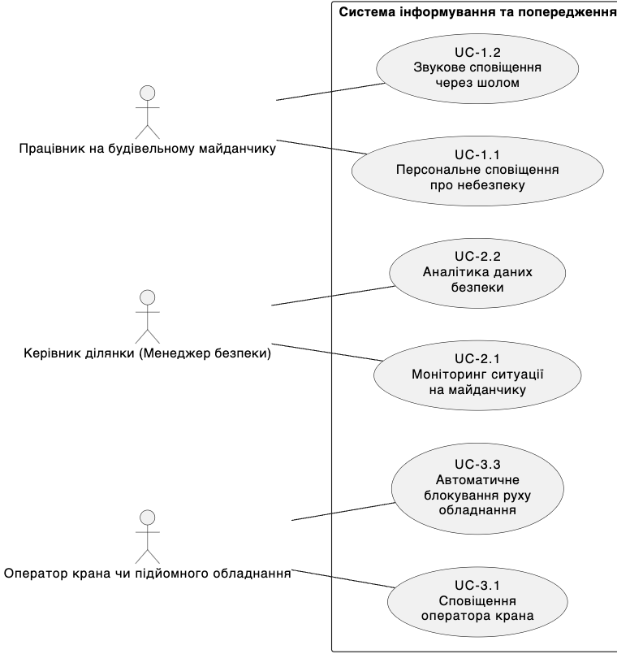

```
@startuml
left to right direction

actor "Працівник на будівельному майданчику" as worker
actor "Керівник ділянки (Менеджер безпеки)" as manager
actor "Оператор крана чи підйомного обладнання" as operator

rectangle "Система інформування та попередження" {
    usecase "UC-1.1\nПерсональне сповіщення\nпро небезпеку" as uc11
    usecase "UC-1.2\nЗвукове сповіщення\nчерез шолом" as uc1_2
    usecase "UC-2.1\nМоніторинг ситуації\nна майданчику" as uc2_1
    usecase "UC-2.2\nАналітика даних\nбезпеки" as uc2_2
    usecase "UC-3.1\nСповіщення\nоператора крана" as uc3_1
    usecase "UC-3.3\nАвтоматичне\nблокування руху\nобладнання" as uc3_3

    worker -- uc11
    worker -- uc1_2
    manager -- uc2_1
    manager -- uc2_2
    operator -- uc3_1
    operator -- uc3_3
}

@enduml

```