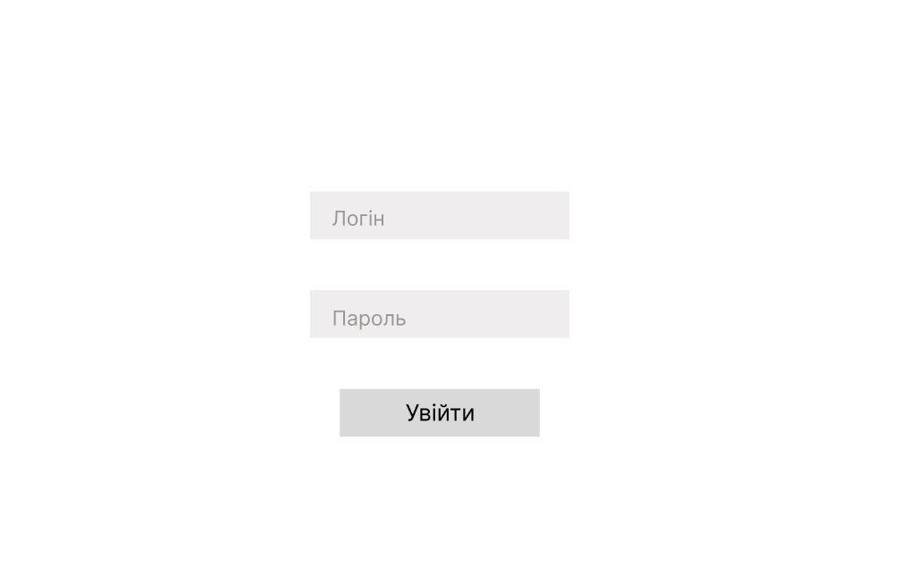
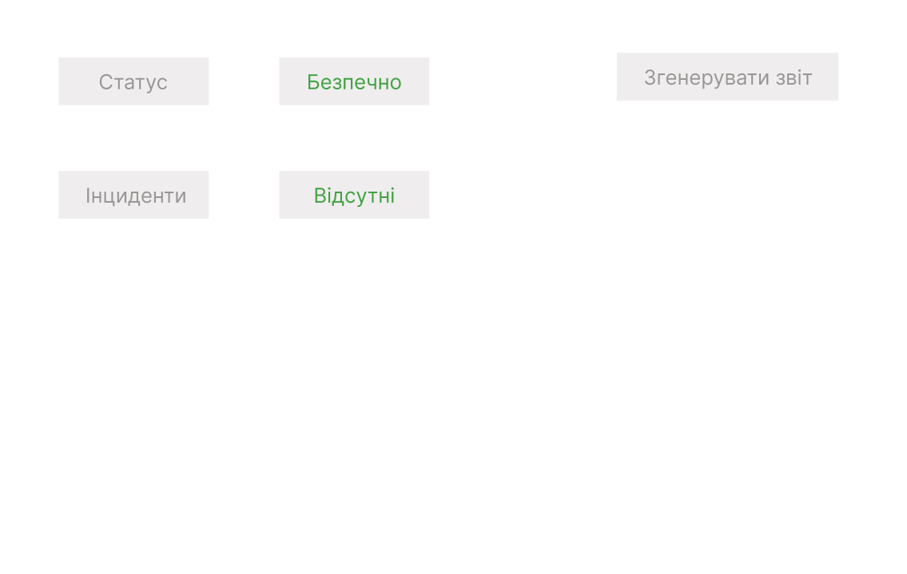
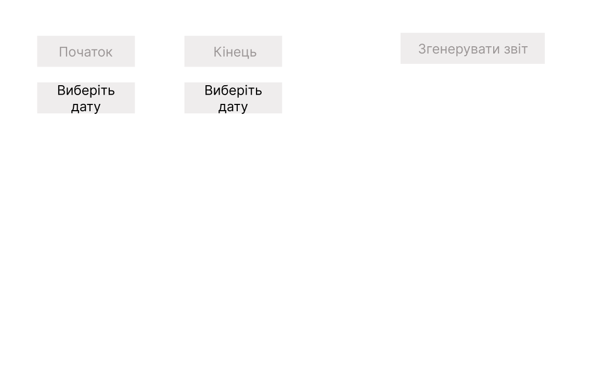
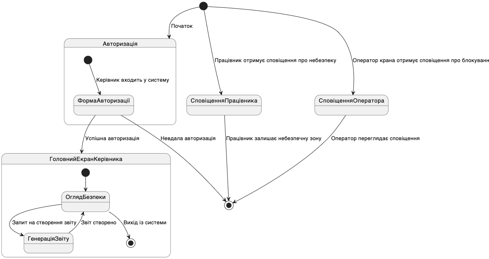

# Проект каркасу програми

## 1. Екран авторизації (керівник)
- **Опис**: Вхід у систему, який здійснює лише керівник для моніторингу та управління. Інші учасники системи (працівники, оператор крана) отримують сповіщення без авторизації.
- **Елементи**:
  - Поля "Ім’я користувача" та "Пароль"
  - Кнопка "Увійти"
- **Переходи**:
  - Успішна авторизація веде до **головного екрана керівника**.

---

## 2. Головний екран (керівник)
- **Опис**: Екран для керівника, який дозволяє переглядати стан майданчика та контроль за ситуаціями, що вимагають уваги.
- **Елементи**:
  - Панель із загальним статусом безпеки
  - Перелік активних інцидентів та поточних загроз
  - Кнопка для генерації звіту за запитом
- **Переходи**:
  - Натискання "Генерувати звіт" веде до **екрану генерації звіту**.
  - Вибір інциденту відкриває **деталі конкретного випадку**.

---

## 3. Екран генерації звіту (керівник)
- **Опис**: Дозволяє керівнику формувати звіти про інциденти та загрози для аналізу.
- **Елементи**:
  - Поле вибору періоду для звіту
  - Кнопка "Згенерувати звіт"
  - Історія збережених звітів з можливістю завантаження.
- **Переходи**:
  - Після натискання "Згенерувати звіт" система повертається на головний екран керівника, а звіт додається до історії.

---

## 4. Сповіщення працівника про небезпечну зону (шолом/телефон)
- **Опис**: Працівник не має окремого екрану в системі, а отримує лише сповіщення на шолом (через вібрацію) або на телефон.
- **Сповіщення активується автоматично**:
  - **Вібрація шолома** — при вході працівника в небезпечну зону.
  - **Сповіщення на телефоні** — якщо працівник наближається до зони ризику.
- **Елементи сповіщення**:
  - Інформація про небезпечну зону
  - Інструкція з напрямком до безпечної зони (в текстовій формі).
- **Переходи**:
  - Після виходу з небезпечної зони вібрація та сповіщення припиняються автоматично.

---

## 5. Сповіщення для оператора крана про блокування (телефон)
- **Опис**: Оператор крана отримує сповіщення на телефон про небезпечну зону чи блокування руху обладнання.
- **Сповіщення активується автоматично**:
  - Коли у зоні дії крана виявлено критичну загрозу (наприклад, перебування людини).
- **Елементи сповіщення**:
  - Інформація про причину блокування
  - Інструкція для відновлення безпечної роботи (якщо передбачено).
- **Переходи**:
  - Блокування знімається автоматично після підтвердження, що зона безпечна, або після завершення небезпечної ситуації.

---

## Загальні переходи
- На кожному екрані керівника є кнопка "Вихід" для повернення на екран авторизації.
- Усі сповіщення для працівників і оператора крана автоматично генеруються та надсилаються без потреби авторизації в системі.

## Діаграма
