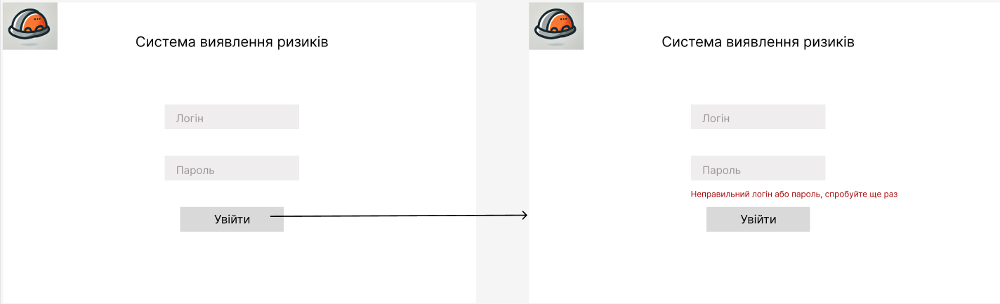
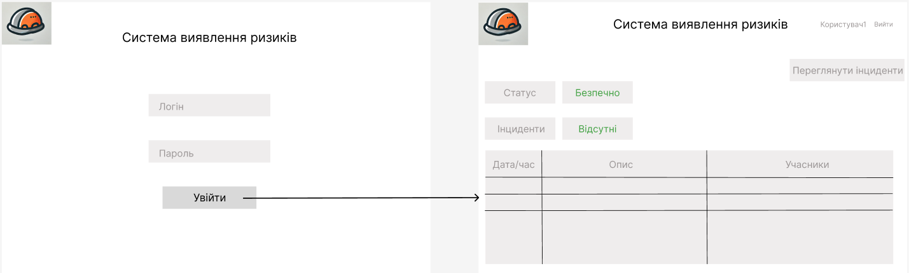
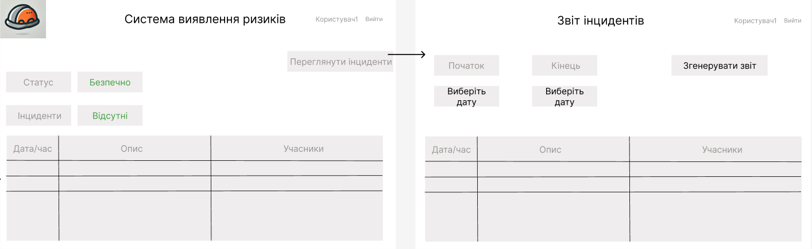

# Макети програмного продукту

## **NFR_1 - Екран Авторизації**
1. **Верхня панель**:
    - Логотип системи (ліворуч).
    - Назва продукту/системи (по центру).

2. **Форма для введення даних**:
    - Поле для введення логіну (підпис: "Логін").
    - Поле для введення паролю (підпис: "Пароль").
    - Кнопка "Увійти" для підтвердження введених даних.

3. **Підтвердження**:
    - Якщо введені дані правильні, відбувається перехід на головний екран.
    - Якщо дані неправильні, з’являється помилка і пропонується спробувати ще раз.

---

## **NFR_2 - Головний Екран Керівника**
1. **Верхня панель**:
    - Логотип системи (ліворуч).
    - Назва продукту/системи (по центру).
    - Профіль користувача та кнопка виходу з системи (праворуч).

2. **Основні елементи**:
    - Кнопка "Користувач" для доступу до налаштувань користувача.
    - Список поточних інцидентів або загроз.
    - Кнопка "Переглянути інциденти" для перегляду інцидентів за вибраний період.

3. **Додаткові елементи**:
    - Динамічне оновлення даних, автоматичне попередження про нові інциденти.

---

## **NFR_3 - Інтерфейс для Керівника при Звіті Інцидентів**
1. **Основна частина**:
    - Заголовок: "Звіт інцидентів".
    - Таблиця або список з інцидентами (відображення часу, опису, учасників загрози).

2. **Функціональні елементи**:
    - Фільтри для пошуку інцидентів за типом, датою або пріоритетом.
    - Кнопка для створення нового звіту - "Згенерувати звіт".

---

## **NFR_4 - Сповіщення про Небезпеку для Працівника**
1. **Основна частина**:
    - Заголовок: "Сповіщення про небезпеку".
    - Повідомлення: текстовий блок з описом небезпеки або інструкцією (наприклад, "Ви наближаєтесь до небезпечної зони!").

2. **Додаткові елементи**:
    - Можливість додавання звукового сигналу або вібрації через телефон або шолом.

---

## **NFR_5 - Повідомлення про Блокування для Оператора Крана**
1. **Основна частина**:
    - Заголовок: "Інформація про блокування крана".
    - Повідомлення про автоматичне блокування крана: "Рух крана заблоковано через виявлення небезпеки у зоні дії".

2. **Інструкції для оператора**:
    - "Переглянути звіт" для отримання більш детальної інформації (якщо потрібно).

---
