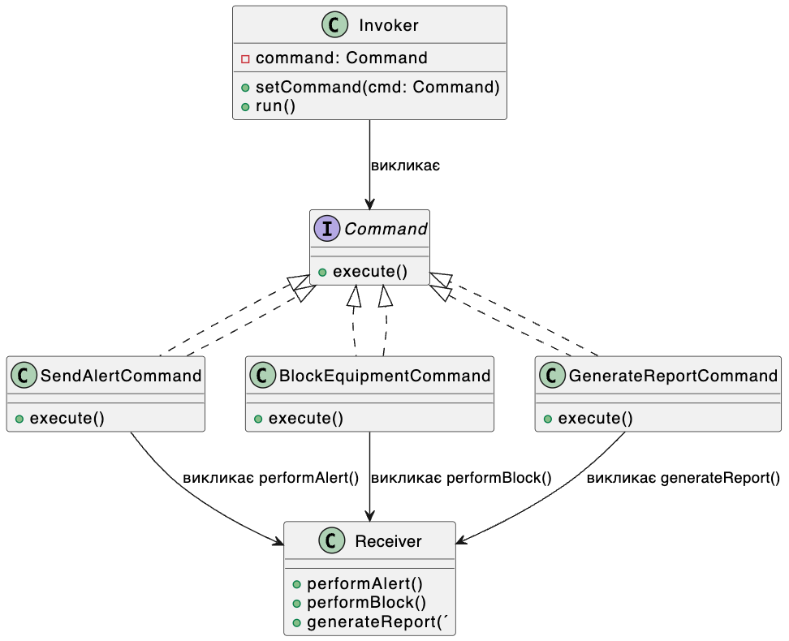

## Пропонований шаблон проектування: Команда (Command)

### Обґрунтування вибору шаблону
Для програмного продукту, орієнтованого на управління діями та взаємодіями в межах безпечного робочого середовища, шаблон "Команда" є доцільним вибором. Використання шаблону "Команда" дозволяє інкапсулювати кожну операцію або дію (наприклад, надсилання сповіщення, блокування обладнання, генерацію звіту) у вигляді окремого об'єкта-команди. Це надає гнучкість у виконанні, відміні, зберіганні та реєстрації дій для забезпечення злагодженого і контрольованого виконання вимог безпеки.

**Шаблон "Команда" підходить для цього проекту, оскільки:**
- Спростить централізацію управління різними діями, що необхідно для чіткого контролю над важливими процесами, як-от блокування обладнання та повідомлення користувачів.
- Забезпечить зручне додавання нових дій для різних сценаріїв (наприклад, різні типи сповіщень або реакцій).
- Дозволить реєстрацію та відкат дій в разі помилок чи змін умов.

---

## Специфікація класів

### 1. Клас `Command` (Інтерфейс Команд)
- **Призначення**: Абстрактний інтерфейс, що визначає метод виконання.
- **Метод**:
  - `execute()`: Виконує команду.

### 2. Клас `SendAlertCommand` (Команда Надсилання Сповіщення)
- **Призначення**: Реалізує команду для надсилання сповіщення працівнику, оператору або керівнику.
- **Методи**:
  - `execute()`: Надсилає сповіщення відповідному користувачу.

### 3. Клас `BlockEquipmentCommand` (Команда Блокування Обладнання)
- **Призначення**: Виконує блокування обладнання в разі виявлення критичної загрози.
- **Методи**:
  - `execute()`: Виконує блокування обладнання і сповіщає оператора.

### 4. Клас `GenerateReportCommand` (Команда Генерації Звіту)
- **Призначення**: Створює звіт про інциденти за запитом керівника.
- **Методи**:
  - `execute()`: Генерує звіт і надсилає його керівнику.

### 5. Клас `Invoker` (Менеджер Команд)
- **Призначення**: Ініціює виконання команд, взаємодіючи з різними командами (наприклад, у відповідь на події в системі або запити користувачів).
- **Методи**:
  - `setCommand(command: Command)`: Призначає команду для виконання.
  - `run()`: Виконує призначену команду.

### 6. Клас `Receiver` (Виконавець Команд)
- **Призначення**: Об'єкт, який виконує реальні дії, що описані в командах (наприклад, надсилає сповіщення або блокує обладнання).
- **Методи**:
  - `performAlert()`: Відправляє сповіщення.
  - `performBlock()`: Блокує обладнання.
  - `generateReport()`: Генерує звіт.

---

## Потік використання шаблону
1. **Запуск Команд**: Користувач (керівник або система) ініціює певні дії, такі як блокування обладнання або генерація звіту.
2. **Виконання Команд**: `Invoker` надсилає команди до відповідного `Receiver` для виконання, зберігаючи можливість відкату або повторного виконання.

## Специфікація класів 

